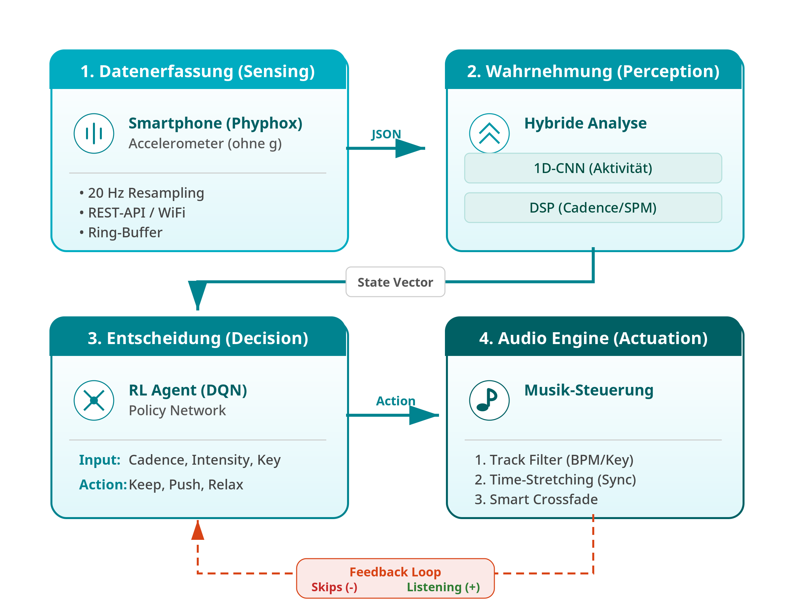

# BPM-Buddy: Adaptive AI Music Synchronization



BPM-Buddy is an intelligent, real-time DJ system for runners. It utilizes smartphone accelerometer data, Deep Learning (1D-CNN), and Reinforcement Learning (DQN) to dynamically adapt music selection and tempo to the user's running cadence and physical intensity.

This project was developed as part of the course **"Advances in Artificial Intelligence"** at **Hochschule Düsseldorf (HSD) - Centre for Digitalisation and Digitality (ZDD)**.

## Table of Contents

- [Project Overview](#-project-overview)
- [Core Architecture & AI Pipeline](#️-core-architecture--ai-pipeline)
- [🛠️ Installation & Setup](#️-installation--setup)
- [Usage & Execution](#-usage--execution)
- [Known Limitations](#-known-limitations-academic-review)
- [Repository Structure](#-repository-structure)
- [Author](#-author)

## Project Overview

Traditional running applications rely on static BPM playlists that ignore the runner's fatigue, natural cadence drift, and musical harmony. BPM-Buddy bridges this gap through an end-to-end AI pipeline:  
It senses the user's motion, perceives the activity type and energy, decides on the optimal audio manipulation strategy to maintain "flow", and actuates the music via a custom audio engine.

## Core Architecture & AI Pipeline

The system is built upon four robust pillars:

- **Perception (1D-CNN):**  
  A Convolutional Neural Network trained on the WISDM dataset classifies 3-second windows of 3-axis accelerometer data (20 Hz) into activities like Jogging or Walking with >98% accuracy.

- **Signal Processing (DSP):**  
  Uses Autocorrelation (ACF) to extract a highly accurate step frequency (Cadence/SPM) and standard deviation of magnitude to estimate physical exertion (Energy).

- **Strategy (Deep Reinforcement Learning):**  
  A Deep Q-Network (DQN) agent acts as the DJ. It learned through thousands of simulated episodes to minimize the BPM-to-Cadence error while strategically penalizing excessive track switches (Hysteresis) to avoid annoying the user.

- **Actuation (Smart Audio Engine):**
  - **Time-Stretching:** Real-time tempo adjustment without pitch distortion using a phase vocoder (`pyrubberband`).
  - **VAD (Voice Activity Detection):** Uses the Silero VAD model to scan tracks and ensure crossfades only happen during instrumental sections, preventing "vocal clashes".


## 🛠️ Installation & Setup

### 1. Prerequisites

- **Python 3.9 - 3.11** (64-bit recommended)
- **Rubberband CLI (Critical for Windows!)**  
  The Python `pyrubberband` library requires the native C++ executable. Download the Rubberband Command-Line Utility and place `rubberband.exe` directly into the project's root directory or add it to your system's `PATH`.

### 2. Clone & Install

```bash
git clone https://github.com/moodydoodi/bpm-buddy.git
cd bpm-buddy
pip install -r requirements.txt
```

### 3. Using Your Own Music

By default, the repository does not contain any .mp3 files due to copyright reasons. To run the system with audio:

    Place your own .mp3 or .wav files into the data/cache_audio/ directory.

    Run python scripts/library_processor.py to analyze your tracks (extracts BPM, Key, Energy).

    Run python scripts/vad_precompute.py to detect vocal sections for clean transitions.


### 4. Run Diagnostics

Before launching the app, verify that all models, directories, and dependencies are correctly placed:

```bash
python sanity_check.py
```

*(Proceed if the console shows **ALL SYSTEMS GO!**)*

## Usage & Execution

BPM-Buddy utilizes a decoupled architecture where the **Backend (Sensor/AI/Audio)** and the **Frontend (Streamlit UI)** run concurrently. They communicate thread-safely via an SQLite database in **Write-Ahead Logging (WAL)** mode.

Start the Control Room:

```bash
streamlit run dashboard.py
```

### Select Mode in the Browser UI

- **Simulation:**  
  Uses synthetic data (`outputs/demo_session.csv`) featuring random walk interpolation to test the AI pipeline locally without running.  
  *(Note: Generate this file first using `python scripts/generate_demo.py`.)*

- **Live Sensor:**  
  Connects to the Phyphox app on your smartphone. Ensure your phone and PC are on the same Wi-Fi, start the **"Acceleration (without g)"** experiment in Phyphox, allow remote access, and update the IP in `system/config.py`.

Hit **"START"** in the Streamlit sidebar.

## Known Limitations (Academic Review)

As a prototype operating at the intersection of edge computing and embodied AI, the system faces several known constraints:

- **Sim-to-Real Gap:**  
  The DQN agent was trained in a simulated environment. While it performs well on synthetic sine-wave accelerometer data, the natural noise (jitter) of a physical smartphone inside a pocket can cause state-space deviations, occasionally leading to sub-optimal hysteresis behavior. Future work requires Domain Randomization during training.

- **Windows IPC Constraints:**  
  Standard Python multiprocessing constructs (like Queues) struggle under Windows due to the spawn method and the Global Interpreter Lock (GIL). We mitigated this by building a custom IPC bridge using SQLite in WAL mode.

- **Audio Processing Latency:**  
  Real-time phase vocoding (time-stretching) is heavily CPU-bound. Synchronous crossfades can occasionally cause minor buffer under-runs (audio crackling) depending on the host machine's single-core performance.

## Repository Structure

The project has been refactored into a modular, production-ready architecture:

```text
bpm-buddy/
├── system/                     # The core engine package
│   ├── config.py               # Dynamic path resolution & constants
│   ├── audio_engine.py         # Pygame mixer & Time-stretching logic
│   ├── db.py                   # SQLite WAL IPC interface
│   ├── features.py             # DSP / Autocorrelation logic
│   ├── logger_sqlite.py        # High-res telemetry logging
│   ├── policy.py               # PyTorch models (CNN & DQN)
│   └── streams.py              # Phyphox REST client & Simulation parser
├── scripts/                    # Offline preparation tools
│   ├── generate_demo.py        # Synthesizes realistic sensor data
│   └── vad_precompute.py       # Scans library for vocal safe zones
├── models/                     # AI Weights
│   ├── activity_cnn.pth
│   ├── rl_agent_dqn.pth
│   └── silero_vad.jit          # Compiled VAD model
├── data/                       # Local data (Ignored in Git)
│   ├── library/                # Processed JSON databases
│   └── cache_audio/            # Local MP3 files
├── main.py                     # Backend entry point
├── dashboard.py                # Streamlit frontend entry point
├── sanity_check.py             # System diagnostic tool
└── requirements.txt
```

## Author

**Dalia Salih** — *Advances in Artificial Intelligence*  
**Hochschule Düsseldorf (HSD)**
